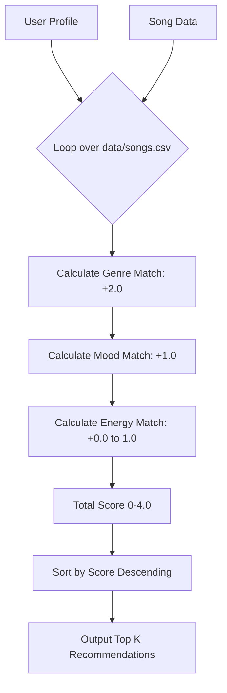

# 🎵 Music Recommender Simulation

## Project Summary

In this project, I built and evaluated a small music recommender system.

My goal was to:
- Represent songs and a user "taste profile" as data
- Design a scoring rule that turns that data into recommendations
- Evaluate what my system gets right and wrong
- Reflect on how this mirrors real-world AI recommenders

This project implements a simplified content-based music recommender system. Real-world platforms like Spotify or YouTube use a mix of collaborative filtering (suggesting based on similar users' interactions and listening habits) and content-based filtering (suggesting based on song metadata like energy, valence, genre, etc.). My version focuses primarily on the **content-based** aspect to connect a specified user taste profile to the catalog's available song metadata.

---

## How The System Works

My recommender calculates a similarity score for each track by matching its metadata to the user's defined preferences. It places priority on closely matching the vibe (energy) and the primary genre, similar to how content-based filtering functions at scale.

**Song Features Used:**
- `genre` (String): e.g., Pop, Rock, Electronic
- `mood` (String): e.g., Happy, Sad, Chill
- `energy` (Float 0.0 - 1.0): Represents intensity/activity level
- `tempo_bpm` (Integer): Speed of the track

**UserProfile Information:**
- `favorite_genre` (String): The genre I want to hear
- `favorite_mood` (String): The desired emotional vibe
- `target_energy` (Float): The ideal energy level for recommendations

**Algorithm Recipe & Scoring Rule:**
- **Genre Match:** +2.0 points if the song's genre exactly matches my favorite genre.
- **Mood Match:** +1.0 point if the song's mood matches my target mood.
- **Energy Similarity:** Up to +1.0 point. Calculated as `1.0 - absolute_difference(song_energy, target_energy)`, penalizing songs the further they drift from the target vibe.

**Recommendation Logic:**
Each song in the dataset is passed through the scoring function to compute a total score out of 4.0 points. The system then sorts all songs by this final score in descending order and returns the top `k` results as recommendations.

**Process Visualization:**



**Potential Biases Expected:**
- The system heavily biases toward exact genre matches. A perfect mood and energy match outside the user's favorite genre can score at most 2.0, while a poorly-matched energy song with the right genre scores at least 2.0. This might trap users in a "genre bubble."
- The limited 15-song catalog restricts variety and may fail to represent diverse minority genres fairly.

---

## Getting Started

### Terminal Output Example
```text
Top recommendations:

Sunrise City - Score: 3.98
Because: genre match (+2.0), mood match (+1.0), energy similarity (+0.98)

Gym Hero - Score: 2.87
Because: genre match (+2.0), energy similarity (+0.87)

Rooftop Lights - Score: 1.96
Because: mood match (+1.0), energy similarity (+0.96)

Sunset Drive - Score: 1.85
Because: mood match (+1.0), energy similarity (+0.85)

Night Drive Loop - Score: 0.95
Because: energy similarity (+0.95)
```

### Setup

1. Create a virtual environment (optional but recommended):

   ```bash
   python -m venv .venv
   source .venv/bin/activate      # Mac or Linux
   .venv\Scripts\activate         # Windows
   ```

2. Install dependencies:

   ```bash
   pip install -r requirements.txt
   ```

3. Run the app:

   ```bash
   python3 -m src.main
   ```

### Running Tests

Run the starter tests with:

```bash
pytest
```

You can add more tests in `tests/test_recommender.py`.

---

## Experiments I Tried

During the evaluation phase, I ran tests across four different profiles:
- **High-Energy Pop** (`energy: 0.9`): The system correctly identified energetic pop tracks.
- **Chill Lofi** (`energy: 0.3`): Perfectly matched ambient, low-energy songs. 
- **Deep Intense Rock** (`energy: 0.95`): Surfaced an intense rock track beautifully thanks to dataset alignment.
- **Adversarial Edge Case - Intense Classical** (`energy: 0.95`): Showed the fragility of the system. Because the dataset had no high-energy classical music, it recommended a "Sad Piano" classical track first purely due to the exact genre match, despite the energy level being completely opposite of what I asked for.

---

## Limitations and Risks

My recommender suffers from several main limitations:
- **Genre Over-weighting:** Since it heavily prioritizes matching strings exactly for the genre, it creates filter bubbles.
- **Small Catalog Constraint:** Finding nothing matching my "Intense Classical" attempt highlighted that if the dataset is small, the algorithm returns irrelevant fallbacks.
- **No Conceptual Understanding:** It doesn't actually "know" what a song sounds like, it merely runs math on numeric constraints.

(I dive deeper into this inside the `model_card.md` file)

---

## Reflection

Read and complete `model_card.md`:

[**Model Card**](model_card.md)

Building this recommender helped me realize how basic math loops can occasionally "feel" intelligent just by surfacing matching tokens. I was surprised at how heavily the system mirrored the biases present in the tiny 15-song dataset; the system physically couldn't satisfy an intense-classical user because no such song existed. 

It made me realize that in real-world platforms like Spotify, human/editorial curation and dataset audits are necessary precisely because basic recommendation algorithms only blindly score what already exists. They don't know when they're giving you a bad song; they just pick the mathematically "least bad" one.
